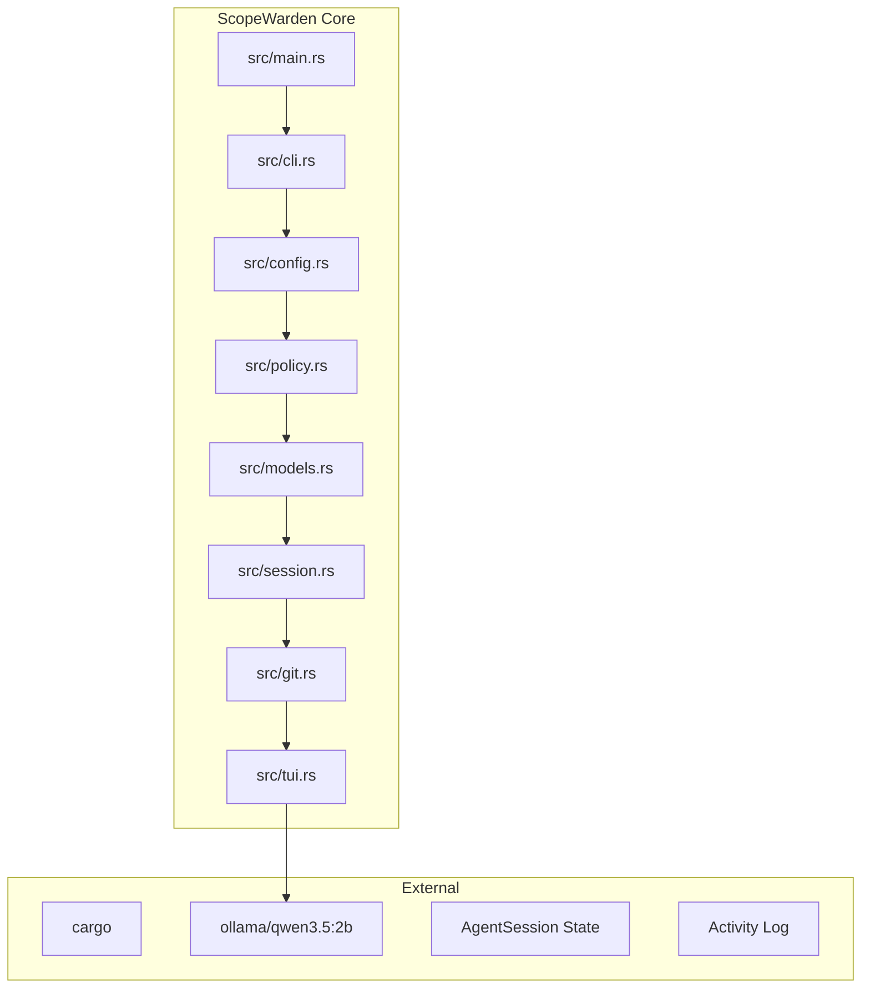

# CLAUDE.md

This file provides guidance to Claude Code (claude.ai/code) when working with code in this repository.

## Overview

ScopeWarden is a Rust CLI that acts as a scope firewall and audit layer for AI coding agents. It records or detects your mission, watches Git changes, applies deterministic policy, and optionally asks a judge model whether the diff still matches the mission.

## Architecture



### Core Components

| Component | Purpose |
|-----------|---------|
| **CLI** (`src/cli.rs`) | Entry point with subcommands: start, check, judge, models, config, audit, attach, monitor, mcp, skills, plugins |
| **Policy Engine** (`src/policy.rs`) | Checks file paths against blocked/warn patterns, extracts scope hints from mission, classifies changes |
| **Session Manager** (`src/session.rs`) | Manages agent sessions, activity logs, and session states |
| **Git Diff Tool** (`src/git.rs`) | Computes working tree diffs against HEAD commit |
| **Model Runner** (`src/models.rs`) | List, set, test, pull Ollama models; set judge defaults |
| **TUI** (`src/tui.rs`) | Live dashboard showing verdicts, health, file lists, sparklines |
| **Activity Log** | JSONL activity log (`src/session.rs`) |

## Quick Commands

### Init / Start a Session

```bash
# Create a new scopewarden.yaml config
scopewarden init

# Start a manual mission
scopewarden start "Fix checkout button loading state" --agent codex

# Start with watching for changes
scopewarden start "Fix checkout button loading state" --agent codex --watch
```

### Agent Context & Monitoring

```bash
# Detect local agent context
scopewarden agents detect

# Doctor configuration issues
scopewarden agents doctor

# Print inferred context
scopewarden agents context --agent auto

# Attach to inferred session
scopewarden attach --agent auto
scopewarden attach --agent auto --apply

# Watch with auto-detect
scopewarden watch

# Monitor and auto-attach high-confidence sessions
scopewarden monitor --agent auto
```

### Check Before Commit

```bash
# Full check with JSON output
scopewarden check --json

# Diff with problem-focused output
scopewarden diff --problems
```

### Judge Models

```bash
# List available judge models
scopewarden model list

# Set default model
scopewarden model set qwen3.5:2b

# Test a model
scopewarden model test

# Pull a model from Ollama
scopewarden model pull llama3

# One-off judge with any model
scopewarden judge -m gemma4:e2b
```

### Config Management

```bash
# Show current configuration
scopewarden config show

# Set a config value
scopewarden config set model qwen3.5:2b
scopewarden config set judge.enabled true
scopewarden config set max_files 50
scopewarden config set team.enabled true

# Open config file in editor
scopewarden config edit

# Reset to preset
scopewarden config reset solo
```

### Hooks (Pre-commit)

```bash
# Install hook
scopewarden hook install

# Uninstall hook
scopewarden hook uninstall

# Check hook status
scopewarden hook status
```

## Configuration (`scopewarden.yaml`)

```yaml
policy:
  # Glob patterns always blocked
  blocked:
    - ".env"
    - ".env.*"
    - "**/.env"
    - "**/.env.*"
    - "**/secrets/**"
    - "**/*.pem"
    - "**/*.key"
    - "src/auth/**"
    - "**/migrations/**"

  # Glob patterns that trigger warning but not block
  warn:
    - "package-lock.json"
    - "yarn.lock"
    - "Cargo.lock"
    - "**/config/**"

  # Max files changed (0 = disabled)
  max_files_changed: 20

  # Max lines changed (0 = disabled)
  max_lines_changed: 800

judge:
  enabled: true
  provider: ollama
  model: "qwen3.5:2b"
  endpoint: "http://localhost:11434"

team:
  enabled: true
  share_logs: true
  log_path: "artifacts"

agents:
  auto_detect: true
  auto_attach: false
  preferred:
    - codex
    - claude-code
    - cursor
```

## Workflow Patterns

### Solo Developer

```bash
scopewarden init

# Watch session
scopewarden watch

# Auto-attach and watch
scopewarden monitor --agent auto

# Check before commit
scopewarden check --problems
scopewarden check --json
```

### Team with Shared Logs

```bash
scopewarden init

# Team preset configures max_files 10, shared logs enabled
# Open .cursor/rules/scopewarden.md for editor guidelines
```

### CI Pipeline

```bash
scopewarden init

# CI preset configures max_files 5, judge disabled
scopewarden config reset ci
```

## Key Files

| File | Purpose |
|------|---------|
| `src/main.rs` | CLI entry point and command routing |
| `src/cli.rs` | Subcommand definitions and argument parsing |
| `src/config.rs` | Configuration loading, persistence, presets |
| `src/policy.rs` | Policy engine, path matching, scope hints |
| `src/models.rs` | Judge model management |
| `src/session.rs` | Session state, activity log |
| `src/git.rs` | Git diff computation |
| `src/tui.rs` | Live TUI dashboard |

## Development

```bash
cargo fmt      # Format code
cargo test     # Run tests
cargo build    # Build release
cargo build --release  # Production binary
```

## License

MIT + Commons Clause. See [LICENSE](LICENSE).

## Resources

- [Documentation](README.md)
- [Configuration Guide](README.md#policy)
- [CONTRIBUTING.md](CONTRIBUTING.md)

---

# ScopeWarden plugin · claude-code

ScopeWarden is a scope firewall and audit cockpit for AI coding agents.
It checks whether your Git changes match the active mission.

## When to run ScopeWarden

| Trigger | Command |
|---------|--------|
| Before starting work | `scopewarden status` |
| While working | `scopewarden watch` (live TUI cockpit) |
| Before finishing | `scopewarden check` |
| Before committing | `scopewarden diff --problems` |

## Quick reference

```
scopewarden init                          # one-time repo setup
scopewarden start "your mission"          # record what you're doing
scopewarden watch                         # live cockpit (1=review 2=chat 3=dash 4=sessions 5=live)
scopewarden check                         # policy check + scope audit
scopewarden check --json                  # machine-readable output
scopewarden judge                         # ask the LLM judge
scopewarden diff --problems               # show suspicious/blocked files only
scopewarden attach --agent auto --apply   # infer mission from this agent's logs
```

## Status labels

| Badge | Meaning |
|-------|---------|
| `EXPECTED` | File matches the active mission scope |
| `SUSPICIOUS` | Changed but no mission rule matches |
| `BLOCKED` | Matched a blocked policy path — hard stop |
| `IGNORED` | Clean, stale, or explicitly excluded |

## TUI keyboard shortcuts

| Key | Action |
|-----|--------|
| `1`–`5` | Switch mode (Review/Chat/Dashboard/Sessions/Live) |
| `Enter` | Open diff overlay for selected file |
| `j` | Run judge on selected file |
| `a` / `b` | Allow / block selected file |
| `t` | Cycle themes (scopewarden/codex/claude/openclaw/high-contrast) |
| `?` | Help overlay |
| `q` | Quit |

## Judge providers

ScopeWarden supports Ollama (local/private), Claude, OpenAI, Gemini, and OpenRouter.

```
scopewarden config set judge.provider ollama      # local, private
scopewarden config set judge.provider claude      # requires ANTHROPIC_API_KEY
scopewarden config set judge.provider openai      # requires OPENAI_API_KEY
scopewarden config set judge.provider gemini      # requires GEMINI_API_KEY
scopewarden config set judge.provider openrouter  # requires OPENROUTER_API_KEY
```

## Policy config (`scopewarden.yaml`)

```yaml
policy:
blocked:
- ".env"
- "**/.env.*"
- "**/secrets/**"
- "**/*.pem"
- "**/*.key"
warn:
- "package-lock.json"
- "yarn.lock"
- "Cargo.lock"
max_files_changed: 20
max_lines_changed: 800
```

Blocked patterns are enforced deterministically — no model can override them.

## More info

Run `scopewarden --help` or visit https://github.com/abdouloued/scopewarden


---

# ScopeWarden plugin · claude-code

ScopeWarden is a scope firewall and audit cockpit for AI coding agents.
It checks whether your Git changes match the active mission.

## When to run ScopeWarden

| Trigger | Command |
|---------|--------|
| Before starting work | `scopewarden status` |
| While working | `scopewarden watch` (live TUI cockpit) |
| Before finishing | `scopewarden check` |
| Before committing | `scopewarden diff --problems` |

## Quick reference

```
scopewarden init                          # one-time repo setup
scopewarden start "your mission"          # record what you're doing
scopewarden watch                         # live cockpit (1=review 2=chat 3=dash 4=sessions 5=live)
scopewarden check                         # policy check + scope audit
scopewarden check --json                  # machine-readable output
scopewarden judge                         # ask the LLM judge
scopewarden diff --problems               # show suspicious/blocked files only
scopewarden attach --agent auto --apply   # infer mission from this agent's logs
```

## Status labels

| Badge | Meaning |
|-------|---------|
| `EXPECTED` | File matches the active mission scope |
| `SUSPICIOUS` | Changed but no mission rule matches |
| `BLOCKED` | Matched a blocked policy path — hard stop |
| `IGNORED` | Clean, stale, or explicitly excluded |

## TUI keyboard shortcuts

| Key | Action |
|-----|--------|
| `1`–`5` | Switch mode (Review/Chat/Dashboard/Sessions/Live) |
| `Enter` | Open diff overlay for selected file |
| `j` | Run judge on selected file |
| `a` / `b` | Allow / block selected file |
| `t` | Cycle themes (scopewarden/codex/claude/openclaw/high-contrast) |
| `?` | Help overlay |
| `q` | Quit |

## Judge providers

ScopeWarden supports Ollama (local/private), Claude, OpenAI, Gemini, and OpenRouter.

```
scopewarden config set judge.provider ollama      # local, private
scopewarden config set judge.provider claude      # requires ANTHROPIC_API_KEY
scopewarden config set judge.provider openai      # requires OPENAI_API_KEY
scopewarden config set judge.provider gemini      # requires GEMINI_API_KEY
scopewarden config set judge.provider openrouter  # requires OPENROUTER_API_KEY
```

## Policy config (`scopewarden.yaml`)

```yaml
policy:
blocked:
- ".env"
- "**/.env.*"
- "**/secrets/**"
- "**/*.pem"
- "**/*.key"
warn:
- "package-lock.json"
- "yarn.lock"
- "Cargo.lock"
max_files_changed: 20
max_lines_changed: 800
```

Blocked patterns are enforced deterministically — no model can override them.

## More info

Run `scopewarden --help` or visit https://github.com/abdouloued/scopewarden

